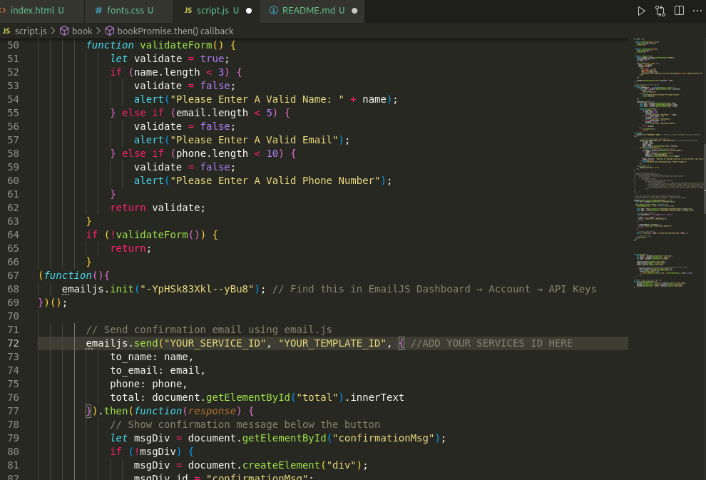

# Laundry Website Frontend

Welcome to the Laundry Website Frontend project! This is a modern, responsive web application designed to simplify laundry service bookings and management for users.

## Features

- User-friendly interface for booking laundry services
- Real-time order tracking
- Service selection and scheduling
- Contact form integration with EmailJS
- Responsive design for all devices

## Getting Started

1. **Clone the repository:**
    ```bash
    git clone https://github.com/404adarsh/Laundry-Services.git
    cd laundry-website-frontend
    ```

2. **Install dependencies:**
    ```bash
    npm install
    ```

3. **Configure EmailJS:**
    - Sign up at [EmailJS](https://www.emailjs.com/) and create an account.
    - Set up your own email service and template.
    - Obtain your **Template ID** and **Public ID** from the EmailJS dashboard.
    - Update the relevant fields in your code with your own IDs.

4. **Run the development server:**
    ```bash
    npm start
    ```

## EmailJS Setup

To enable contact form functionality, you must create an account on EmailJS and configure your own template:

- Go to [EmailJS](https://www.emailjs.com/) and sign up.
- Create a new email template for your contact form.
- Copy your **Template ID** and **Public ID**.
- Replace the placeholder values in the code with your own IDs.

## Screenshots

Below is a preview of the application:

